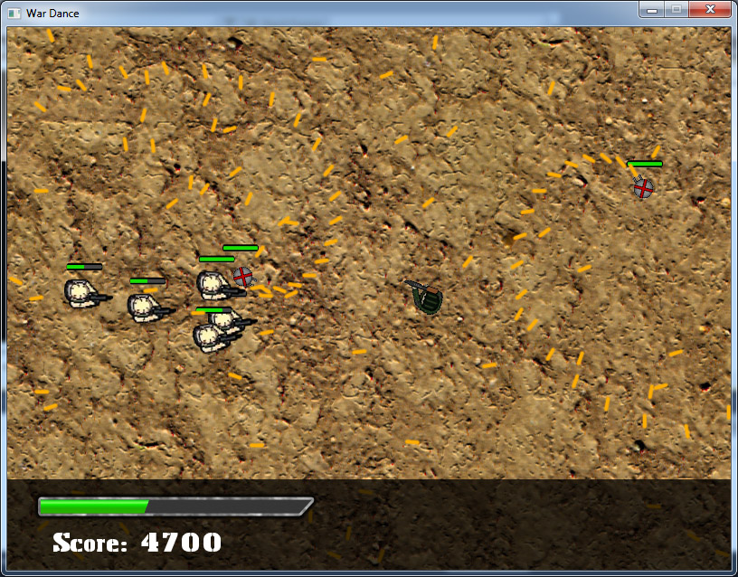

# What

War Dance is a 2D top-down run-and-gun game.

The basic premise is that you run faster than your own bullets. What happens when enemies appear that are just as trigger-happy as you?

You dance.

# Development

War Dance is not really built on top off any proper game engine. Rather, it's used as a project for me to gain experience with game development in C++ and with the Simple and Fast Media Library (SFML). It is still very much a work in progress, and even most of the sprites are temporary and will eventually be replaced. Sounds may be added in the future, although music will be another beast of its own in regards to licensing, etc.

What it currently has:
- Simple in-game GUI with perfunctory HUD
- Simple collision detection with bullets
- Two enemy types: grunt and sprinkler
- Relatively smooth control and response of player movement and shooting

What it will have:
- Complete GUI including menu and HUD
- Multiple levels that involve special stage effects
- More complex enemy types with the addition of bosses
- Player abilities and power-ups
- Sounds!

# Dependencies

If you want to plug the code in and run it, you must have SFML headers/libraries in your include/link paths. Visit http://www.sfml-dev.org/index.php for the installation files.