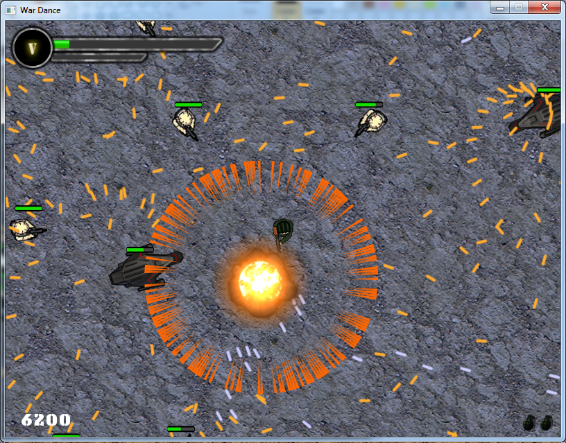

# What #

War Dance is a 2D top-down run-and-gun game.

The basic premise is that you run faster than your own bullets. What happens when enemies appear that are just as trigger-happy as you?

You dance.

# Development #

A 32-bit Windows executable version of WarDance (built on 3/09/14) is available in this root git directory. To run it, simply make sure config, fonts, and images are all present.

War Dance is not really built on top off any proper game engine. Rather, it's used as a project for me to gain experience with game development in C++ and with the Simple and Fast Media Library (SFML). It is still very much a work in progress, and even most of the sprites are temporary and will eventually be replaced. Sounds may be added in the future, although music will be another beast of its own in regards to licensing, etc.

What it currently has:
- Simple main, settings, and pause menus
- Functional and reasonably efficient collision detection
- Three enemy types: grunt, sprinkler, and alien
- Two bullet types: regular bullet and instance laser
- Five temporary levels
- Smooth control and response of player movement and shooting
- Configurable key bindings

What it will have:
- Complete GUI including splash screen and HUD
- Multiple balanced levels
- More complex enemy types with the addition of bosses
- Player abilities and power-ups
- Sounds!

# Building #

If you want to build the project and try it out, you must have SFML 2.1 headers and libaries somewhere. Visit http://www.sfml-dev.org/download/sfml/2.1/ for those files.

### Visual Studio ###

To build on Visual Studio, simply make a new project and import all the source and header files into it. Then, follow the instructions at http://www.sfml-dev.org/tutorials/2.1/start-vc.php to configure SFML for your project. In summary, be sure you've specified: the include location, the link location, and the linked libararies. Also, make sure to copy the corresponding dlls to where your executable will be.

### g++ ###

Building on Linux can range from extremely easy to stupidly complicated. The actual compilation and linking for WarDance are all automated in the Makefile that's included in the src folder, and so simply running "make" or "make release" will initiate the process. But before that, you need to make sure to get the right SFML into your system first.

WarDance uses SFML 2.1. *If* you're on Ubuntu 14.04 or Debian Jessie or above, then aptitude will do everything for you if you just execute:
    sudo apt-get install libsfml-dev

*Where the problem lies* is when you have older versions of Ubuntu or Debian (or if you're using some other distro, in which case I can't help you). By default,the libsfml-dev in those systems is version 1.6, which is completely incompatible with SFML 2.0+. 
There are two things you can do at this point. You can find a PPA that has SFML 2.0+, and do:
    sudo add-apt-respository ppa:<name of PPA>
Then, after you do apt-get update, you may be able to simply apt-get install libsfml-dev and it will give you the right version. I haven't tested this so I can't guarantee it will work.

If you're brave, you can also try downloading the SFML SDK in the page linked above. After untarring it, you have two options:

1. Copy the include and lib files to /usr/local/
2. Move the files somewhere, and edit the Makefile in WarDance to have gcc include/link to that location. You can add something like -I/home/you/SFML-2.1/include to INCFLAGS and -L/home/you/SFML-2.1/lib and -Wl,-rpath=/home/you/SFML-2.1/lib to LNKFLAGS, and it should work.

After this, try entering "make" inside WarDance's src directory. If you're really lucky, it will compile and link sucessfully. Most likely, g++ will complain that you're missing some libraries that SFML needs, and you'd have to look at the errors to discern exactly what. Fortunately, all of those additional libraries can be installed through apt-get.
